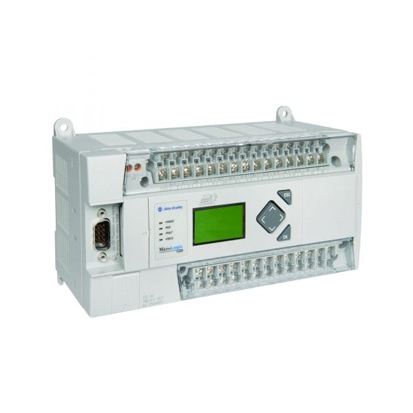
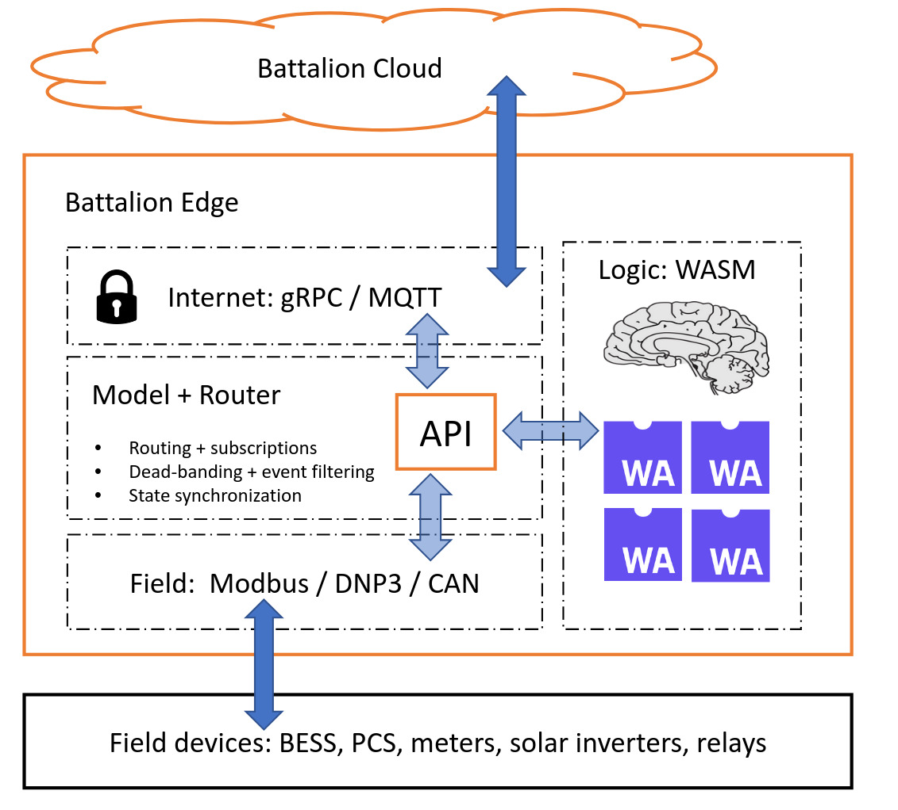

<style>
blockquote {
  background: rgba(0, 0, 0, 0.1);
  border-left: 4px solid #333;
  margin: 1em 0;
  padding: 0.8em 1.2em;
  font-style: italic;
  border-radius: 4px;
  color: #555;
}
.no-bullet {
  list-style: none;
  padding-left: 0;
}
.no-bullet li {
  margin-left: 0;
}
</style>


# WebAssembly Outside the Browser

**Adam Crain**
*June 10th, 2025*

---

# Agenda

- **What is WebAssembly?** - Beyond browsers
- **WIT & WASI** - Interfaces and system APIs  
- **Cloud Promise** - WASM vs containers
- **Plugin Systems** - Safe, sandboxed execution
- **Soft-PLC Case Study** - Industrial automation with WASM

---

# WebAssembly (WASM)

- **Stack-based virtual machine**: Low-level bytecode
- **Language agnostic**: Compile from C/C++, Rust, Go, C#, etc.
- **Small & fast**: Compact binary format, fast startup times
- **Portable**: Write once, run anywhere (browsers, servers, edge, etc)

---
<!-- footer: "" -->

### "BYTE CODE"
### "VIRTUAL MACHINE"
### "WRITE ONCE, RUN ANYWHERE"


---
<!-- footer: "" -->
# I PROMISE IT'S NOT JAVA


---

# Why?

- **JavaScript limitations**: Dynamic typing, JIT compilation overhead
- **Need for true bytecode**: Faster parsing, smaller payloads, predictable performance
- **Cross-language support**: Run C/C++/Rust/Go code in browsers efficiently
- **Sandboxed**: Memory-safe, capability-based security model

---

# WASM History

- **2013**: asm.js - Mozilla's optimizable JavaScript subset proved the concept (Doom 3 BFG & Unreal Engine)
- **2015**: WebAssembly first announced by Mozilla, Google, Microsoft, Apple
- **2017**: MVP (Minimum Viable Product) shipped in all major browsers
- **2019**: W3C standardization - became official web standard
- **2020+**: WASI (WebAssembly System Interface) enables non-browser environments

---

# Simplest WASM Binary - Stack Only

```rust
#[unsafe(no_mangle)]
pub extern "C" fn add(a: i32, b: i32) -> i32 {
  a + b
}
```

```bash
> cargo build --release --target wasm32-unknown-unknown
```

```bash
> ls -ls target/wasm32-unknown-unknown/release
400 no_std_wasm.wasm
```

**400 bytes** (187 bytes stripped)

---

# "Portable Assembly"

```bash
> wasm-tools print target/wasm32-unknown-unknown/no_std_wasm.wasm
```

```wasm
(module $no_std_wasm.wasm
  (type (;0;) (func (param i32 i32) (result i32)))
  < ... omitted ...>
  (func $add (;0;) (type 0) (param i32 i32) (result i32)
    local.get 1
    local.get 0
    i32.add
  )
  < ... omitted ...>
)
```
---

## Think Reverse Polish Notation (RPN)

**Infix:** `5 + 3`
**RPN:** `5 3 +`

**WASM Instructions:**
```wasm
local.get 1    ; Push param 1 onto stack
local.get 0    ; Push param 0 onto stack  
i32.add        ; Pop two values, add, push result
```

**Stack execution**: No registers, just push/pop operations
**Same concept**: HP calculators, PostScript, Forth

---

# Design Advantages

- **Simplicity**: No register allocation complexity
- **Compact encoding**: Instructions don't specify operand locations
- **Fast validation**: Easy to verify type safety during load
- **Portable**: No assumptions about target architecture registers
- **Streaming compilation**: Can compile without full module analysis

---
# What about using the heap?

```rust
#[unsafe(no_mangle)]
pub extern "C" fn add(a: i32, b: i32) -> i32 {
    let x = String::from("foo");
    let y = String::from("bar");
    (x.len() + y.len()) as i32
}
```

```wasm
(func $add (;0;) (type 0) (param i32 i32) (result i32)
    i32.const 6
)
```

Yes, this is an asinine function. The compiler also was able to determine the sum of string sizes at compile time. 🤦

---
# Getting trickier

```rust
#[unsafe(no_mangle)]
pub extern "C" fn add(a: i32, b: i32) -> i32 {
    let mut count = 0;
    let x = String::from("foobar");
    for c in x.chars() {
        if "aeiouAEIOU".contains(c) {
            count += 1;
        }
    }

    count as i32
}


```

```bash
> ls -ls target/wasm32-unknown-unknown/release
33953 no_std_wasm.wasm
```

---

# Language Overhead Comparison

| Language | Min Bundle Size | Bundled Features |
|----------|----------------|------------------|
| **Rust** | ~34KB | String handling, UTF-8, heap allocator |
| **Go** | ~2MB+ | Garbage collector, goroutine runtime, full stdlib |
| **Python** | ~10MB+ | CPython interpreter, stdlib modules, pip packages |

**Key Insight**: More dynamic features = larger runtime overhead

**Rust advantage**: Zero-cost abstractions, opt-in runtime features

---

# WIT: WebAssembly Interface Types

### Interface Definition Language (IDL) for WASM

- **Problem**: WASM only supports basic types (i32, i64, f32, f64)
- **WIT**: Define rich interfaces with strings, records, variants, lists

```wit
interface calculator {
  add: func(a: s32, b: s32) -> s32
  divide: func(dividend: f64, divisor: f64) -> result<f64, string>
}
```

---

# WIT Binding Generation

```
                    calculator.wit
                         |
                   wit-bindgen
                    /         \
                   /           \
        Host Bindings       Guest Bindings
     (Rust/Go/JS/Python)   (Rust/C/TinyGo)
              |                   |
              |                   |
        Host Runtime          WASM Module
      (wasmtime/wasmer)    (calculator.wasm)
              |                   |
              \_<<<<<<_____>>>>>>_/
                      calls
```

**One interface → Multiple language bindings**

---

# WASI: WA System Interface

- **Goal**: Portable system interface for non-browser environments
- **WIT-Defined**: All WASI APIs are specified using WIT
- **Capability-based**: Fine-grained permissions (no ambient authority)

**WASI 0.2 Interfaces:**

`filesystem` | `sockets` | `clocks` | `random` | `cli`

**Result**: Write once, run on any WASI-compliant runtime

---

# Can my existing programs target WASM?

**Reality**: Maybe?

```rust
use std::fs;
use std::io::Result;

fn main() -> Result<()> {
    let contents = fs::read_to_string("config.toml")?;
    println!("Config: {}", contents);
    Ok(())
}
```

---

# Behind the Scenes

- `std::fs` automatically maps to WASI filesystem APIs
- Rust stdlib provides abstraction layer over WASI
- Use `wasm32-wasip2` compilation target

**Current Limitations:**
- **No threads**: WASI doesn't support threading yet
- **No shared memory**: Each WASM instance is isolated
- **Limited async**: Basic futures work, but complex runtimes may not (Tokio)

---

# Better Than Containers?

- **Cold Start:** Containers (100ms-2s) vs WASM (<1ms)
- **Resources:** Containers (MB + OS) vs WASM (KB, no OS)
- **Security:** Containers (kernel isolation) vs WASM (capability-based)
- **Density:** Containers (10-100/host) vs WASM (1000s/host)

> If WASM+WASI existed in 2008, we might not have needed Docker
> — Solomon Hykes (Docker co-founder)

---

# WIT-Based Plugin Systems

- **Safe execution**: Sandboxed, untrusted code
- **Language agnostic**: Plugins in Rust, Go, C, JS, Python
- **Hot reload**: Update plugins without restarting host
- **Resource control**: Fine-grained permissions per plugin

---
# Plug-in Examples

- **Text Editor**: Syntax highlighting, formatters, language servers
- **CI/CD Pipeline**: Custom build steps, deployment hooks, validators
- **Data Processing**: ETL transforms, custom aggregations, filters
- **Game Engine**: Scripting, mods, custom game logic
- **Web Server**: Middleware, request handlers, auth providers

---
# The "Complexity Clock" for Configuration


> .... We’re back where we started four years ago, hard coding everything, except now in a much crappier language.


https://mikehadlow.blogspot.com/2012/05/configuration-complexity-clock.html

---
# Configuring OpenTelemetry Collector in "OTTL"

```yaml
transform/edge_remap:
    error_mode: ignore
    log_statements:
      - statements:
        - merge_maps(log.cache, ParseJSON(log.body["MESSAGE"]), "insert")
        
        - set(log.attributes["unit"], log.body["_SYSTEMD_UNIT"])
        - set(log.attributes["message"], log.cache["fields"]["message"])
        - set(log.attributes["level"], log.cache["level"])
        - set(log.attributes["spans"], log.cache["spans"])

        - set(log.severity_number, 1) where log.cache["level"] == "TRACE"
        - set(log.severity_number, 5) where log.cache["level"] == "DEBUG"
        - set(log.severity_number, 9) where log.cache["level"] == "INFO"
        - set(log.severity_number, 13) where log.cache["level"] == "WARN"
        - set(log.severity_number, 17) where log.cache["level"] == "ERROR"

        - keep_keys(log.attributes, ["unit", "site_name", "message", "level", "spans"])
        - keep_keys(log.body, [])
```

---


### Programmable Logic Controller (PLC)

- Embedded hardware that executes user programs
- Abstracts I/O and often communication (Modbus)
- Used in manufacturing, energy, pharma, building control, theme parks


---
# Status Quo

<ul class="no-bullet">
<li>✅ <b>Real-time</b>: Guaranteed timing and excellent reliability
<li>❌ <b>Expensive tooling</b>: $5K-$50K+ for software licenses</li>
<li>❌ <b>Closed / proprietary ecosystems</b>: Siemens, Allen-Bradley, etc</li>
<li>❌ <b>Limited languages</b>: LL, FBD, Structured Text</li>
<li>❌ <b>High barrier to entry</b>: Expensive tools limit innovation</li>
<li>❌ <b>Monolithic</b>: Hard to test, version, or modularize control logic</li>
</ul>

---

### Control Platform

<ul class="no-bullet">
<li>✅ <b>Hardware agnostic</b></li>
<li>✅ <b>Leverage modern CPUs</b></li>
<li>✅ <b>Host abstracts I/O</b></li>
</ul>

### Pluggable "Logic"

<ul class="no-bullet">
<li>✅ <b>WASM plugins via WIT</b></li>
<li>✅ <b>Rust ATM</b></li>
<li>✅ <b>Patch logic independently</b></li>
<li>✅ <b>3rd parties just need the WIT</b></li>
<li>❌ <b>Not realtime but "fast enough"</b></li>
</ul>

---

# Questions?


- **Email**: adam.crain@battalion.energy
- **Presentation**: QR Code ->
- **GitHub**: @jadamcrain
- **LinkedIn**: /in/energycoder

